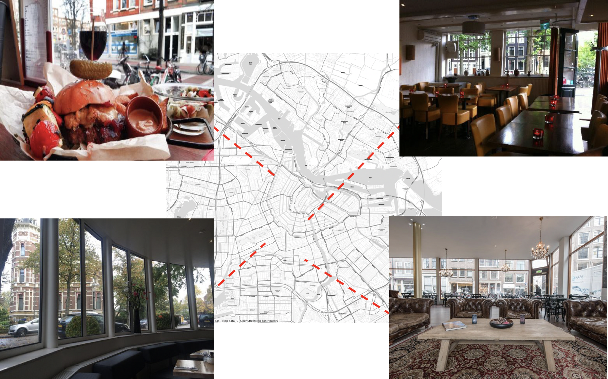
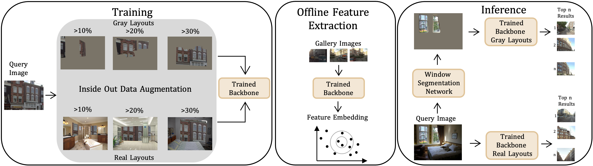

# Inside Out Visual Place Recognition
This repository contains code and instructions to reproduce the results for the Inside Out Visual Place Recognition task and to retrieve the dataset Amsterdam-XXXL. Details are described in our [[paper]](https://www.bmvc2021-virtualconference.com/assets/papers/0467.pdf) and [[supplementary material]](https://www.bmvc2021-virtualconference.com/assets/supp/0467_supp.zip)

<p align="center">
    
</p>


## Dataset

Our dataset Amsterdam-XXXL consists of 3 partitions: 
+ **Outdoor-Ams**: A set of 6.4M GPS annotated street-view images, meant for evaluation purposes but can be used for training as well.
+ **Indoor-Ams**: 2 sets of 500 indoor images each, that are used as queries during evaluation
+ **Ams30k**: A small set of GPS annotated street-view images, modelled after Pitts30k, that can be used for training purposes.

Contact s.ibrahimi@uva.nl to get access to the dataset.

## Code

This code is based on the code of 'Self-supervising Fine-grained Region Similarities for Large-scale Image Localization (SFRS)' [[paper]](https://arxiv.org/abs/2006.03926) from https://github.com/yxgeee/OpenIBL.

#### Main Modifications
+ It is able to process the dataset files for IOVPR.
+ It is able to evaluate on the large scale dataset Outdoor-Ams.
+ It uses Faiss for faster evaluation.


#### Requirements
+ Follow the installation instructions on https://github.com/yxgeee/OpenIBL/blob/master/docs/INSTALL.md
+ You can use the conda environment iovpr.yml as provided in this repo.
+ Training on Ams30k requires 4 GPUs. Evaluation on Ams30k can be done on 1 GPU. For evaluating on the full Outdoor-Ams, we used a node with 8 GeForce GTX 1080 Ti GPUs. A node with 4 GPUs is not sufficient and will cause memory issues. 


## Inside Out Data Augmentation
<p align="center">
    
</p>


#### Data processing
In our pipeline we use real and gray layouts to train our models. To create real and gray lay outs we use the ADE20k dataset that can be obtained from http://sceneparsing.csail.mit.edu. This dataset is meant for semantic segmentation and therefore annotated on pixel level, with 150 semantic categories. We select indoor images from the train and validation set. Since 1 of the 150 semantic categories is 'window', we create binary masks of window and non-window pixels of each image. This binary mask is used to create real and gray layouts, as described in our paper. We create three sets of at least 10%, 20% and 30% window pixels.

#### Inference
During inference with gray layouts, we need a semantic segmentation network. For this, we use the code from https://github.com/CSAILVision/semantic-segmentation-pytorch. We use the pretrained UperNet50 model and finetune the model with the help of the ADE20k dataset on two output classes, window and non-window. The code in this link need some small modifications to finetune it on two classes.

## Training and evaluating our models

Details on how to train the models can be found here: https://github.com/yxgeee/OpenIBL/blob/master/docs/REPRODUCTION.md. Only adapt the dataset(=Ams) and scale(=30k).

For evaluation, we use test_faiss.sh. 

Ams30k:
```shell
./scripts/test_faiss.sh <PATH TO MODEL> ams <30k> <PATH TO STORE FEATURES> <FEATURE_FILE_NAME>
```

Outdoor-Ams:
```shell
./scripts/test_faiss.sh <PATH TO MODEL> ams <outdoor> <PATH TO STORE FEATURES> <FEATURE_FILE_NAME>
```
Note that this uses faiss_evaluators.py instead of the original evaluators.py.

## License

'IOVPR' is released under the [MIT license](LICENSE).


## Citation

If you work on the Inside Out Visual Place Recognition or use our large scale dataset for regular Visual Place Recognition, please cite our paper.
```
@inproceedings{iovpr2021,
    title={Inside Out Visual Place Recognition},
    author={Sarah Ibrahimi and Nanne van Noord and Tim Alpherts and Marcel Worring},
    booktitle={BMVC}
    year={2021},
}
```

## Acknowledgements

This repo is an extension of [SFRS](https://github.com/yxgeee/OpenIBL), which is inspired by [open-reid](https://github.com/Cysu/open-reid), and part of the code is inspired by [pytorch-NetVlad](https://github.com/Nanne/pytorch-NetVlad).

